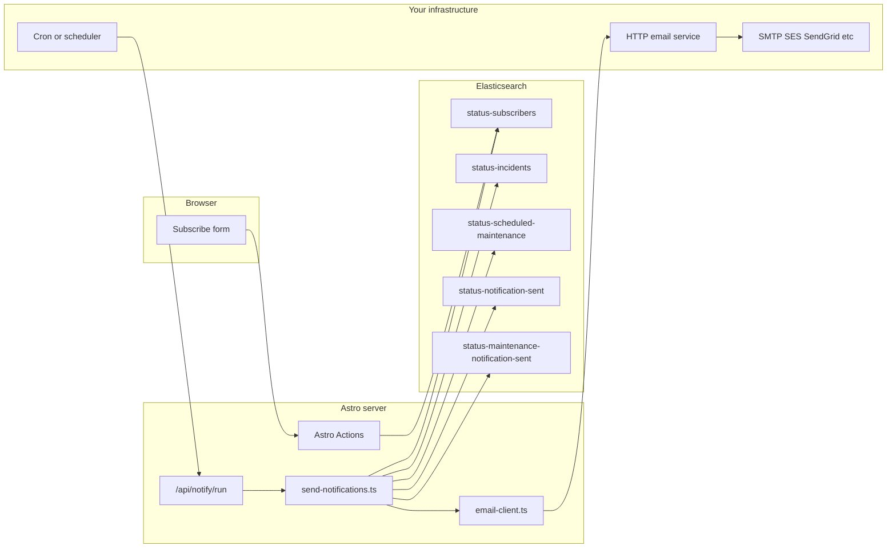

# Email notifications: setup and operations

This guide explains how **status email notifications** work in the roadmap Astro app and what you must configure **outside** the repo: an HTTP email service, environment variables, scheduling, and Elasticsearch indices used for subscribers and deduplication.

The application **does not** embed SMTP, SendGrid, Amazon SES, or Nodemailer. It sends mail by **POSTing JSON** to a URL you control. See [§2](#2-email-service-contract).

**Related:** [ELASTICSEARCH_GUIDE.md](./ELASTICSEARCH_GUIDE.md) for index names, fields, and privileges.

---

## Table of contents

1. [Architecture](#1-architecture)
2. [Email service contract](#2-email-service-contract)
3. [Environment variables](#3-environment-variables)
4. [Subscriber flow](#4-subscriber-flow)
5. [Incident and maintenance delivery](#5-incident-and-maintenance-delivery)
6. [Scheduling and securing `/api/notify/run`](#6-scheduling-and-securing-apinotifyrun)
7. [Elasticsearch dependencies](#7-elasticsearch-dependencies)
8. [Troubleshooting](#8-troubleshooting)
9. [Appendix: minimal relay service example](#9-appendix-minimal-relay-service-example)

---

## 1. Architecture



- **Subscribe:** The user submits an email on the status page; the `subscribe` Action validates input, **indexes a document** in the subscribers index (see [ELASTICSEARCH_GUIDE.md §6.8](./ELASTICSEARCH_GUIDE.md#68-status-subscribers-write--read)), and optionally sends a **confirmation email** if the email service is configured.
- **Delivery job:** Something you operate (cron, Kubernetes CronJob, GitHub Actions, platform scheduler, etc.) calls **`GET` or `POST`** `/api/notify/run` on a schedule. That handler runs `runNotificationDelivery()` which loads incidents and maintenance from Elasticsearch, compares against dedupe indices, and calls the HTTP email service once per recipient per logical send.

There is **no in-app queue** (no Redis, SQS, Bull). Sending is **synchronous** in the request: the handler awaits each `sendEmail` call in sequence.

---

## 2. Email service contract

Implementation: `src/lib/notifications/email-client.ts`.

### 2.1 Request

| Item | Value |
|------|--------|
| Method | `POST` |
| URL | **`{EMAIL_SERVICE_URL}`** with trailing slash stripped, then **`/` + `{EMAIL_SERVICE_PATH}`** (default path segment `send` → final URL like `https://mail-internal.example.com/send`) |
| Headers | `Content-Type: application/json`; if `EMAIL_SERVICE_API_KEY` is set, **`Authorization: Bearer <EMAIL_SERVICE_API_KEY>`** |
| Body | JSON: **`{ "to": string, "subject": string, "body": string }`** |

The in-code comment also mentions an alternate body shape `{ to, subject, text }` for documentation flexibility; the **implemented** payload uses **`body`**.

### 2.2 Response

- **Success:** Any HTTP **2xx** response is treated as success.
- **Failure:** Non-2xx or network error: the client logs, returns `false`, and the notification runner records an error string for that recipient.

### 2.3 Custom APIs

If your internal API uses a different path or JSON shape, you have two options:

1. Deploy a **small adapter** that exposes the contract above and forwards to your real provider (recommended; see [§9](#9-appendix-minimal-relay-service-example)).
2. **Fork** `email-client.ts` in your project to match your API (keep changes localized).

---

## 3. Environment variables

| Variable | Required | Default | Role |
|----------|----------|---------|------|
| `EMAIL_SERVICE_URL` | **Yes** for any email | _(empty)_ | Base URL of the HTTP mail API. If empty, **no** emails are sent; `sendEmail` logs a warning and returns `false`. |
| `EMAIL_SERVICE_PATH` | No | `send` (used as path segment after base URL) | Path appended to `EMAIL_SERVICE_URL` (leading slash stripped from env value so `send` becomes `/send`). |
| `EMAIL_SERVICE_API_KEY` | No | _(unset)_ | If set, sent as `Authorization: Bearer …` |
| `SITE_URL` | Recommended for links | _(empty)_ | Preferred base URL for links in incident/maintenance emails. |
| `STATUS_PAGE_BASE_URL` | Fallback | _(empty)_ | Used if `SITE_URL` is empty when building links. |
| `NOTIFICATION_INCIDENT_WINDOW_MINUTES` | No | `1440` | How far back to look for incidents and maintenance relevant to notifications (see [ELASTICSEARCH_GUIDE.md §5.3–5.7](./ELASTICSEARCH_GUIDE.md#53-notifications-getincidentsfornotifications)). |
| `NOTIFY_WEBHOOK_SECRET` | No | _(unset)_ | If set, **`POST /api/notify/run`** requires `Authorization: Bearer <same secret>`. |

Copy-paste list: `roadmap/.env.example`.

### 3.1 When `EMAIL_SERVICE_URL` is unset

- **Subscribe:** `addSubscriber` still runs; duplicate emails are still deduped in Elasticsearch. **Confirmation email is skipped** (`isEmailServiceConfigured()` is false).
- **`/api/notify/run`:** `runNotificationDelivery()` returns immediately with `errors: ['EMAIL_SERVICE_URL not configured']` and `sent: 0`.

### 3.2 Link URLs in emails

`src/lib/notifications/email-templates.ts` builds incident links as:

`{base}/roadmap/status/incidents/{incidentId}`

where `base` is `SITE_URL` or `STATUS_PAGE_BASE_URL` (trailing slash removed). If both are empty, emails contain a **relative path only** (no absolute URL).

---

## 4. Subscriber flow

Implementation: `src/actions/index.ts` and `src/lib/notifications/elastic-subscribers.ts`.

1. User submits email through the subscribe form (handled by middleware + `subscribe` Action).
2. Email is trimmed, lowercased, validated.
3. If a document with `email.keyword` equal to that address already exists, the Action returns success **without** adding a duplicate.
4. Otherwise a new document is indexed with `email` and `@timestamp`.
5. If `EMAIL_SERVICE_URL` is set, a **confirmation** email is sent with subject and body from `buildSubscribeConfirmationSubject` / `buildSubscribeConfirmation`.

---

## 5. Incident and maintenance delivery

Implementation: `src/lib/notifications/send-notifications.ts`, with data from `src/lib/status/elastic-status.ts` and dedupe in `notification-state.ts` / `maintenance-notification-state.ts`.

### 5.1 Preconditions

- `EMAIL_SERVICE_URL` configured.
- At least one subscriber in the subscribers index (otherwise the job exits with `sent: 0` and no errors).

### 5.2 Incidents

For each incident returned by `getIncidentsForNotifications()`:

1. Load **last sent state** for `incident_id` from `status-notification-sent` (latest `@timestamp` for that id).
2. **Decide** notification type: `new`, `update`, or `resolved` (see `determineNotification`):
   - No prior state → `new` if unresolved, else `resolved` if already resolved when first seen.
   - Resolved after prior non-resolved send → `resolved`.
   - Unresolved with changed `updates` signature vs last send → `update`.
3. For each subscriber email, call `sendEmail(to, subject, body)`.
4. **Record** state with `recordSent` (new document in `status-notification-sent`).

**Update detection** uses a concatenation of `timestamp:message` for all updates in the incident document.

### 5.3 Scheduled maintenance

After processing incidents:

1. Load maintenance candidates from `getMaintenanceForNotifications()`.
2. For each item, if `getMaintenanceSentState(maintenance_id)` is true, **skip** (already emailed).
3. Otherwise send the maintenance email to every subscriber, then `recordMaintenanceSent(maintenance_id)`.

### 5.4 Performance and limits

- Subscribers: up to **1000** emails read per `getSubscribers()` call (see Elasticsearch guide).
- No batching: many subscribers × many incidents = many sequential HTTP calls in one `/api/notify/run` invocation. **Schedule** accordingly (e.g. every few minutes) and monitor timeouts on your host.

---

## 6. Scheduling and securing `/api/notify/run`

Implementation: `src/pages/api/notify/run.ts`.

| Method | Auth | Use |
|--------|------|-----|
| `GET` | **None** in the reference app | Cron `curl` / health checks. **Protect at the edge** in production (private network, mTLS, API gateway, or IP allowlist) because anyone who can hit the URL could trigger delivery. |
| `POST` | If `NOTIFY_WEBHOOK_SECRET` is set, require **`Authorization: Bearer <NOTIFY_WEBHOOK_SECRET>`**; otherwise 401 | Webhooks from CI or schedulers that can send headers. If the secret is **unset**, `POST` is **not** gated by this check. |

**Suggested cron:** every **2–5 minutes** is a reasonable starting point; align with how quickly you need incident emails and with serverless timeouts if applicable.

**Idempotency:** Dedupe is stored in Elasticsearch (`status-notification-sent`, `status-maintenance-notification-sent`). Re-running the job is safe: already-sent maintenance is skipped; incidents use last-sent state to avoid duplicate **types** unless state changes.

---

## 7. Elasticsearch dependencies

| Index | Role |
|-------|------|
| `ELASTICSEARCH_INDEX_INCIDENTS` | Source incidents for notifications |
| `ELASTICSEARCH_INDEX_SCHEDULED_MAINTENANCE` | Source maintenance windows |
| `ELASTICSEARCH_INDEX_STATUS_SUBSCRIBERS` | Recipient list |
| `ELASTICSEARCH_INDEX_STATUS_NOTIFICATION_SENT` | Incident dedupe state |
| `ELASTICSEARCH_INDEX_STATUS_MAINTENANCE_NOTIFICATION_SENT` | Maintenance dedupe |

The app must have **read + write** access to subscriber and dedupe indices; **read** access to incidents and maintenance indices. See [ELASTICSEARCH_GUIDE.md §3](./ELASTICSEARCH_GUIDE.md#3-suggested-cluster-privileges).

---

## 8. Troubleshooting

| Symptom | Things to check |
|---------|-------------------|
| No emails at all | `EMAIL_SERVICE_URL` set in **server** env; mail service logs; TLS/firewall from your host to mail API |
| `errors` contains `EMAIL_SERVICE_URL not configured` | Variable missing in production environment |
| `sent: 0`, empty `errors` | No subscribers in index, or `getIncidentsForNotifications` / `getMaintenanceForNotifications` returned nothing (window too narrow, wrong index names) |
| 401 on `POST /api/notify/run` | `Authorization: Bearer` must match `NOTIFY_WEBHOOK_SECRET` exactly |
| Duplicate emails | Rare if dedupe indices work; check cluster write permissions and that `recordSent` / `recordMaintenanceSent` are not failing |
| Links in email broken | Set `SITE_URL` or `STATUS_PAGE_BASE_URL` to the public origin of the site |
| Confirmation on subscribe never arrives | Same as general “no email”; subscribe may still succeed in ES |

---

## 9. Appendix: minimal relay service example

**Not part of this repo.** Use as a pattern for your own service.

A tiny Node (Express) relay that accepts the app’s contract and forwards via your provider’s SDK or SMTP:

```javascript
import express from 'express';

const app = express();
app.use(express.json());

const EXPECTED_TOKEN = process.env.INBOUND_BEARER; // optional

app.post('/send', async (req, res) => {
  if (EXPECTED_TOKEN) {
    const auth = req.headers.authorization || '';
    const token = auth.startsWith('Bearer ') ? auth.slice(7) : '';
    if (token !== EXPECTED_TOKEN) return res.status(401).json({ error: 'Unauthorized' });
  }
  const { to, subject, body } = req.body;
  if (!to || !subject || body === undefined) {
    return res.status(400).json({ error: 'to, subject, body required' });
  }
  // TODO: call SendGrid, SES, nodemailer, etc.
  console.log('send', { to, subject });
  return res.status(200).json({ ok: true });
});

app.listen(process.env.PORT || 3000);
```

Point Astro’s `EMAIL_SERVICE_URL` at this relay (e.g. `http://relay.internal:3000`) and set `EMAIL_SERVICE_PATH` if your path differs. Match `EMAIL_SERVICE_API_KEY` to `INBOUND_BEARER` if you use bearer auth.

---

## Related documentation

- [ELASTICSEARCH_GUIDE.md](./ELASTICSEARCH_GUIDE.md) — indices, queries, fields  
- [INTEGRATION_GUIDE.md §19](./INTEGRATION_GUIDE.md#19-deployment-incident-notification-job) — short deploy note for the notify endpoint  
- [STATUS_PAGE_DATA.md](./STATUS_PAGE_DATA.md) — subscribe form behavior  
